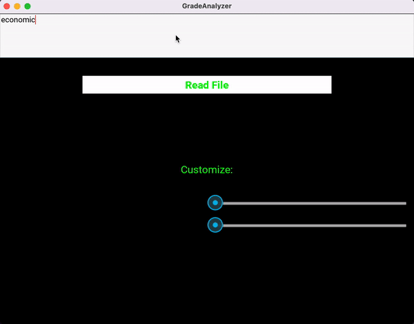

# GradeAnalyzer
Compute statistics for [Genesis Grade Portal](https://parents.ewrsd.k12.nj.us/genesis/parents?gohome=true).

## Usage
1. Clone the repo & [install kivy](https://kivy.org/doc/stable/gettingstarted/installation.html)
2. Save the HTML of a specific Genesis class
    - URL format should follow `https://parents.ewrsd.k12.nj.us/genesis/parents?tab1=studentdata&tab2=gradebook&tab3...`
3. Run `main.py` to parse and extract existing grades and values
4. Input the filename of the saved HTML file
    - `"economics.html"` is provided as an example to run this program
5. Use `Target Grade slider` to set the desired final grade, will be used to predict needed assignment weight to achieve this. 
6. Use `Next Weight slider` to predict the _grade_ needed on the next assignment to end with desired final grade
    - _Note: `Next Weight slider` depends on the grade set with `Target Grade slider`_
    
    
